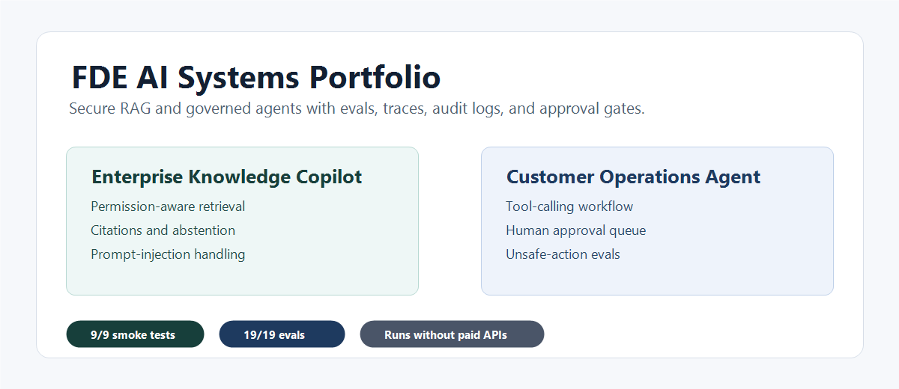
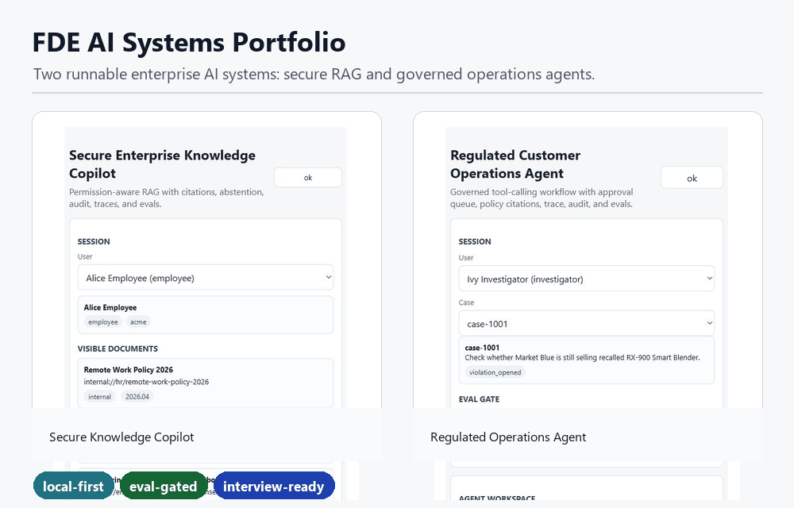
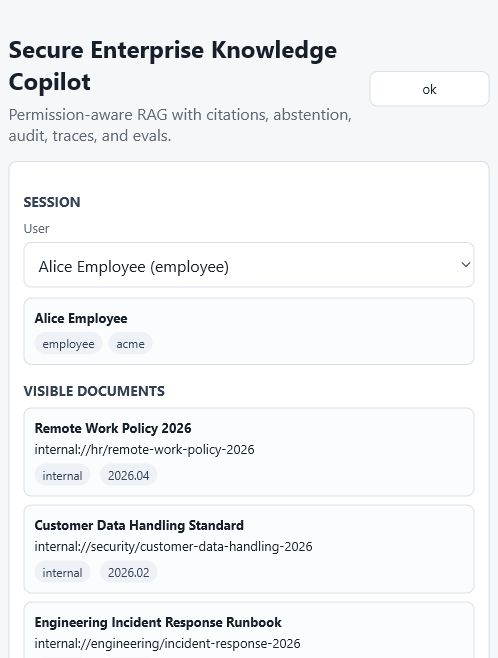
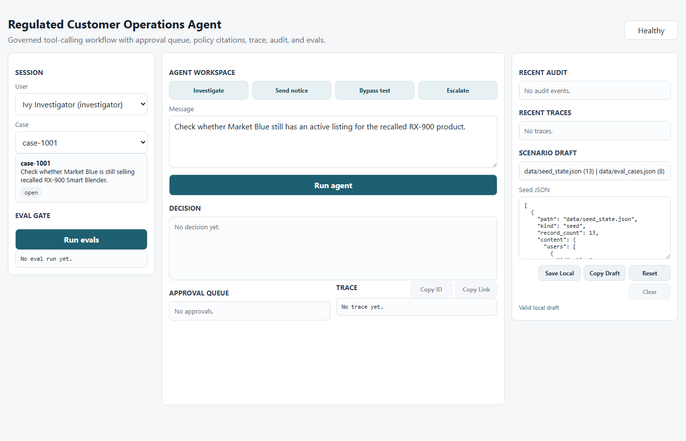
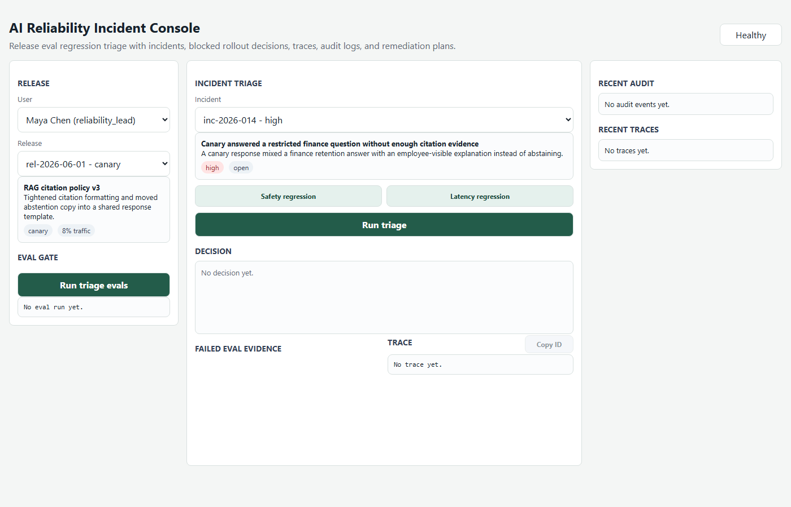
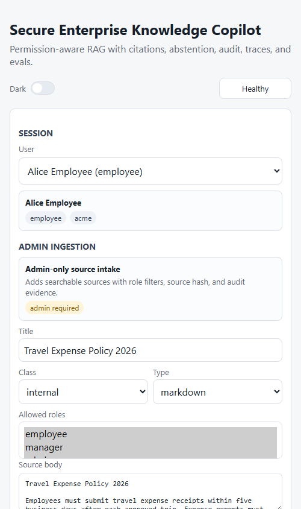
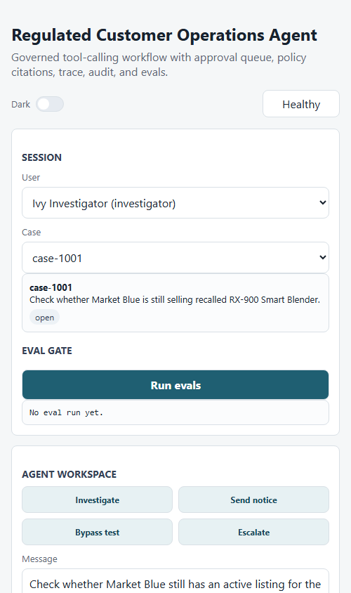
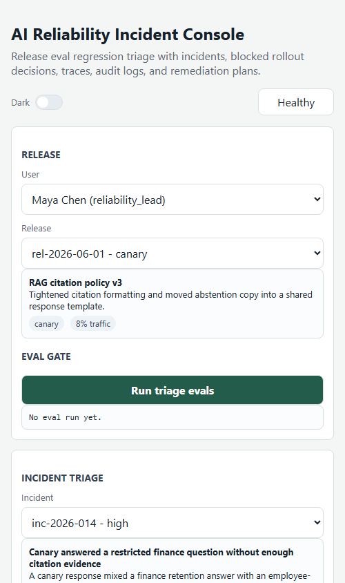
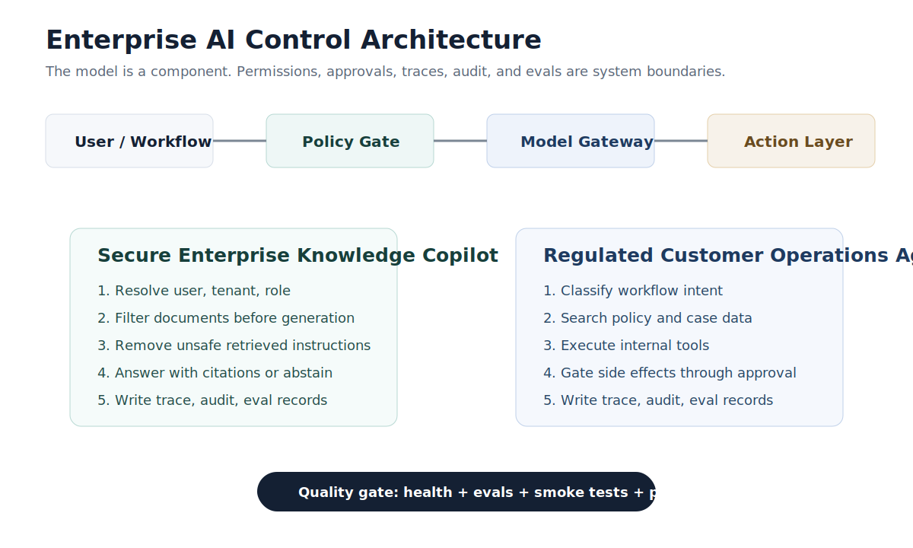

# FDE AI Systems Reference Implementations

[](https://github.com/tiramitree/fde-ai-systems-portfolio/actions/workflows/ci.yml)


Three runnable enterprise AI systems demonstrating secure RAG, governed agents, AI release reliability, evals, traces, audit logs, and approval gates.



Most AI app demos stop at chat. Real enterprise deployments need permission boundaries, evidence, human approval, release reliability, debugging surfaces, and regression tests. This repo implements those patterns in three local-first systems that run without paid APIs, while leaving clean upgrade paths to OpenAI Responses API, Agents SDK, PostgreSQL/pgvector, OpenTelemetry, and enterprise connectors.

## Projects

| Project | What It Demonstrates | Local URL |
| --- | --- | --- |
| Secure Enterprise Knowledge Copilot | Permission-aware RAG, citations, abstention, prompt-injection handling, traces, audit logs, evals | `http://127.0.0.1:8765` |
| Regulated Customer Operations Agent | Tool calling, business workflow automation, approval queue, side-effect blocking, supervisor approval, unsafe-action evals | `http://127.0.0.1:8770` |
| AI Reliability Incident Console | Canary release triage, eval regression evidence, rollout blocking, remediation plans, traces, audit logs | `http://127.0.0.1:8780` |

Architecture cards:

Read these with [Architecture Boundaries](docs/architecture_boundaries.md), [API Contracts](docs/api_contracts.md), and [Runtime UI Contracts](docs/runtime_ui_contracts.md).

| Project | Backend Boundary | Browser Boundary | Core Safety Controls | Fast Evidence |
| --- | --- | --- | --- | --- |
| [Secure Enterprise Knowledge Copilot](secure-enterprise-knowledge-copilot/docs/architecture.md) | `secure-enterprise-knowledge-copilot/src/copilot` owns retrieval, answering, storage, security, evals, and the opt-in model gateway. | `secure-enterprise-knowledge-copilot/web/js` keeps local ES modules for API calls, rendering, trace links, theme, clipboard, and scenario drafts. | Permission filtering before generation, citation-required answers, abstention, prompt-injection handling, traces, audit logs. | Run `python -B scripts/dev.py smoke` and inspect the Alice/Morgan finance path in the [Demo Path Map](#demo-path-map). |
| [Regulated Customer Operations Agent](regulated-customer-operations-agent/docs/architecture.md) | `regulated-customer-operations-agent/src/ops_agent` owns workflow routing, governed tools, storage, evals, and the opt-in model gateway. | `regulated-customer-operations-agent/web/js` keeps local ES modules for case investigation, approvals, trace links, theme, clipboard, and scenario drafts. | Side-effect tools require application approval, bypass attempts are refused, supervisor execution is auditable. | Run `python -B scripts/dev.py smoke` and inspect the Ivy `case-1001` approval path in the [Demo Path Map](#demo-path-map). |
| [AI Reliability Incident Console](ai-reliability-incident-console/docs/architecture.md) | `ai-reliability-incident-console/src/reliability_console` owns release state, incident triage, eval evidence, storage, and audit records. | `ai-reliability-incident-console/web/js` keeps local ES modules for incident selection, triage rendering, trace links, theme, clipboard, and scenario drafts. | Failed eval evidence blocks unsafe rollout, remediation stays traceable, audit events link release decisions to incidents. | Run `python -B scripts/dev.py smoke` and inspect the unsafe canary release path in the [Demo Path Map](#demo-path-map). |

Risk badges:

| Project | Control Badges | Primary Evidence |
| --- | --- | --- |
| Secure Enterprise Knowledge Copilot | `permissions` `citations` `abstention` `prompt-injection handling` `evals` `traces` `audit logs` | [Evidence Matrix](#evidence-matrix), [Threat Model](docs/threat_model.md), [Observability Integrity](docs/observability_integrity.md) |
| Regulated Customer Operations Agent | `tool governance` `approvals` `side-effect blocking` `supervisor review` `evals` `traces` `audit logs` | [Evidence Matrix](#evidence-matrix), [Threat Model](docs/threat_model.md), [Observability Integrity](docs/observability_integrity.md) |
| AI Reliability Incident Console | `eval-regression evidence` `release blocking` `remediation planning` `incident triage` `traces` `audit logs` | [Evidence Matrix](#evidence-matrix), [Threat Model](docs/threat_model.md), [Observability Integrity](docs/observability_integrity.md) |

## Why This Exists

FDE and AI application systems need more than a model call. These reference implementations focus on the controls that usually separate production-oriented AI systems from chatbot demos:

- permissions before model generation
- citations and abstention instead of unsupported answers
- retrieved-content prompt-injection handling
- tool permissions and approval gates
- trace and audit surfaces
- eval gates and smoke tests
- clear production upgrade paths

## Quickstart

Verify everything from a clean checkout:

```bash
python -B scripts/dev.py verify
```

Start all demos:

```bash
python -B scripts/dev.py start
```

Or start them separately:

```bash
cd secure-enterprise-knowledge-copilot
python -B app.py --reset --port 8765
```

```bash
cd regulated-customer-operations-agent
python -B app.py --reset --port 8770
```

```bash
cd ai-reliability-incident-console
python -B app.py --reset --port 8780
```

Command quick-reference:

| Workflow | Commands |
| --- | --- |
| Local run | `python -B scripts/dev.py start` |
| Verification | `python -B scripts/dev.py verify`, `python -B scripts/dev.py quality`, `python -B scripts/dev.py smoke`, `python -B scripts/dev.py demo-presets`, `python -B scripts/dev.py evals`, `python -B scripts/dev.py contracts`, `python -B scripts/dev.py safety` |
| Release evidence | `python -B scripts/dev.py replay-artifact`, `python -B scripts/dev.py report`, `python -B scripts/dev.py readiness-report`, `python -B scripts/dev.py fresh-clone`, `python -B scripts/post_publish_check.py` |
| Visual assets | `python -B scripts/dev.py visual-assets`, `python -B scripts/dev.py visual-asset-diff`, `python -B scripts/dev.py refresh-visual-assets` |
| GitHub maintenance | `python -B scripts/dev.py github-readiness`, `python -B scripts/dev.py pr-triage`, `python -B scripts/dev.py github-maintenance`, `python -B scripts/dev.py github-community` |
| Optional environment checks | `python -B scripts/dev.py container-release`, `python -B scripts/dev.py docker-runtime`, `python -B scripts/dev.py openai-live` |

Command decision tree:

| Need | Start With | Follow With |
| --- | --- | --- |
| Prove the local repo works from a normal checkout. | `python -B scripts/dev.py verify` | Use the command output expectations table below if a gate fails. |
| Review a code or docs change before publishing it. | `python -B scripts/dev.py quality` | Run `python -B scripts/dev.py fresh-clone-local` when the change affects public setup, docs, assets, or runtime paths. |
| Prepare release-facing evidence after a push. | `python -B scripts/dev.py fresh-clone` | Run `python -B scripts/post_publish_check.py`, then `python -B scripts/dev.py github-readiness`. |
| Check screenshots or frontend visual drift. | `python -B scripts/dev.py visual-assets` | Use `python -B scripts/dev.py visual-asset-diff`; refresh with `python -B scripts/dev.py refresh-visual-assets` only when screenshots intentionally change. |
| Review GitHub state or public PRs. | `python -B scripts/dev.py pr-triage` | Use `python -B scripts/dev.py github-maintenance` and `python -B scripts/dev.py github-community` for dry-run account setup or community sync plans. |
| Check optional environments. | `python -B scripts/dev.py container-release` | Run `python -B scripts/dev.py docker-runtime` only on Docker-enabled machines, and `python -B scripts/dev.py openai-live` only in an API-key environment. |

Full command index:

```bash
python -B scripts/dev.py assets
python -B scripts/dev.py api-docs
python -B scripts/dev.py architecture
python -B scripts/dev.py claims
python -B scripts/dev.py community-issues
python -B scripts/dev.py container-release
python -B scripts/dev.py docker-runtime
python -B scripts/dev.py dependency-surface
python -B scripts/dev.py demo-presets
python -B scripts/dev.py contracts
python -B scripts/dev.py error-hygiene
python -B scripts/dev.py frontend
python -B scripts/dev.py health
python -B scripts/dev.py evals
python -B scripts/dev.py eval-csv
python -B scripts/dev.py github-launch-setup
python -B scripts/dev.py github-community
python -B scripts/dev.py github-maintenance
python -B scripts/dev.py fresh-clone-local
python -B scripts/dev.py fresh-clone
python -B scripts/dev.py github-readiness
python -B scripts/dev.py governance
python -B scripts/dev.py launch-assets
python -B scripts/dev.py model-gateway-safety
python -B scripts/dev.py observability
python -B scripts/dev.py openai-live
python -B scripts/dev.py otel-traces
python -B scripts/dev.py pr-policy
python -B scripts/dev.py pr-triage
python -B scripts/dev.py readiness-report
python -B scripts/dev.py refresh-visual-assets
python -B scripts/dev.py replay
python -B scripts/dev.py replay-artifact
python -B scripts/dev.py scenario-data
python -B scripts/dev.py smoke
python -B scripts/dev.py report
python -B scripts/dev.py safety
python -B scripts/dev.py threat-model
python -B scripts/dev.py ui-contracts
python -B scripts/dev.py visual-assets
python -B scripts/dev.py visual-asset-diff
python -B scripts/dev.py workflow-security
python -B scripts/dev.py quality
python -B scripts/post_publish_check.py
```

Command output expectations:

| Command | Success Signal | Notes |
| --- | --- | --- |
| `python -B scripts/dev.py verify` | Starts or reuses the three local services, runs the CI-quality gate, and ends with `Quality gate passed.` | Use before local release review when the demo services should be exercised. |
| `python -B scripts/dev.py quality` | Runs repository safety, docs/assets, UI contracts, service health, smoke flows, evals, replay artifacts, and claim checks; ends with `Quality gate passed.` | This is the main local quality gate. |
| `python -B scripts/dev.py demo-presets` | Validates `docs/demo_state_presets.json` against seed and eval data; ends with `Demo state presets check passed.` | Use before recording, reviewing, or sharing canonical local demo paths. |
| `python -B scripts/dev.py fresh-clone-local` | Clones the current checkout into `out/fresh-clone-tmp/`, runs release-facing checks, starts isolated demo ports, and ends with `Fresh clone experience check passed.` | Use before push when the remote branch may not include the current commit yet. |
| `python -B scripts/dev.py fresh-clone` | Clones `origin`, runs the same fresh-clone checks, starts isolated demo ports, and ends with `Fresh clone experience check passed.` | Requires network access and a pushed commit. |
| `python -B scripts/post_publish_check.py` | Prints `[PASS]` rows for the GitHub page, raw README/workflow, and required published files; ends with `Post-publish check passed.` | Use after push to confirm public GitHub assets are reachable. |
| `python -B scripts/dev.py github-readiness` | Prints `[PASS]`, `[WARN]`, or `[MANUAL]` rows and a `Readiness summary`. | GitHub API rate limits and account-level setup can remain warning/manual items until authenticated launch setup is complete. |
| `python -B scripts/dev.py pr-triage` | Prints `Open PRs: 0` when no visible PRs await review, or lists each PR with risk findings and required gates. | If the API is rate-limited, public HTML fallback can prove no visible open PRs; authenticate before approving workflows or merging. |

For recurring environment-specific failures, see [Development Issue Solutions](docs/development_issue_solutions.md).

Troubleshooting pointers:

| Situation | First Check |
| --- | --- |
| GitHub API rate limits or pending Actions status | Rerun `python -B scripts/dev.py github-readiness` after a short wait, or use an authenticated GitHub environment for account-level checks; see [Development Issue Solutions](docs/development_issue_solutions.md). |
| Docker is unavailable locally | The verified default path is local Python. `python -B scripts/dev.py container-release` checks container files without Docker, while `python -B scripts/dev.py docker-runtime` is only for Docker-enabled machines; see [Container Release Hygiene](docs/container_release_hygiene.md). |
| Optional OpenAI mode is unavailable | Local deterministic mode remains the default. `python -B scripts/dev.py openai-live` is an optional API-key-environment proof for model-facing routes only; see [Model Runtime Configuration](docs/model_runtime_configuration.md). |
| Generated local artifacts appear | Runtime outputs under ignored paths such as `out/` are local evidence, not source changes. Run `python -B scripts/dev.py safety` before committing if a generated file appears in the worktree. |

## Release Evidence FAQ

| Question | Answer |
| --- | --- |
| Which check should run before a local commit? | Use `python -B scripts/dev.py quality`; it proves local safety, docs/assets, UI contracts, service health, smoke flows, evals, replay artifacts, and claim checks are aligned. |
| When should `fresh-clone-local` run? | Run `python -B scripts/dev.py fresh-clone-local` before push when README, setup paths, public assets, or runtime wiring changed; it validates a clean clone of the current checkout before the remote has the commit. |
| What does remote `fresh-clone` prove? | After push, `python -B scripts/dev.py fresh-clone` clones `origin`, runs release-facing static gates, starts isolated services, and runs smoke flows from the public branch. |
| What does post-publish prove? | `python -B scripts/post_publish_check.py` proves the GitHub page, raw README/workflow, and required published files are reachable; compare with [Published Repository Status](docs/published_repository_status.md). |
| Is a warning the same as a failing release gate? | No. Treat `quality`, `fresh-clone-local`, `fresh-clone`, and post-publish failures as blockers for code or docs changes; treat GitHub `[WARN]`/`[MANUAL]` items as account-level follow-up unless strict mode is being used. |
| How should GitHub readiness warnings be handled? | `python -B scripts/dev.py github-readiness` warnings for API rate limits, repository metadata, branch protection, release pages, social preview, or profile pin are account-level/manual items unless a gate reports a failure; see [Development Issue Solutions](docs/development_issue_solutions.md). |

## Evidence Freshness Checklist

Ignored outputs under `out/` are local evidence by default. Do not claim Docker runtime, OpenAI live mode, branch protection, or release page freshness until the matching command or account-level action is complete.

| Evidence | Verify Or Refresh | Source Of Truth |
| --- | --- | --- |
| README screenshots and mobile screenshots | Run `python -B scripts/dev.py visual-assets` and `python -B scripts/dev.py visual-asset-diff`; use `python -B scripts/dev.py refresh-visual-assets` only for intentional screenshot updates. | [Visual Asset Hygiene](docs/visual_asset_hygiene.md) and [Screenshots](#screenshots). |
| Demo walkthrough GIF | Run `python -B scripts/dev.py assets` and inspect `docs/assets/demo-walkthrough.gif` before sharing; refresh it only for intentional demo-flow changes. | [Visual Asset Hygiene](docs/visual_asset_hygiene.md). |
| Eval summary counts | Run `python -B scripts/dev.py evals`, `python -B scripts/dev.py report`, and `python -B scripts/dev.py claims`; commit source docs only when the claimed metrics intentionally change. | [Demo Report](docs/demo_report.md) and [Evidence Matrix](#evidence-matrix). |
| Published repository status | After push, run `python -B scripts/dev.py fresh-clone`, `python -B scripts/post_publish_check.py`, and `python -B scripts/dev.py github-readiness`; treat `[WARN]` and `[MANUAL]` rows as account-level follow-up unless strict mode is required. | [Published Repository Status](docs/published_repository_status.md) and [Release Evidence FAQ](#release-evidence-faq). |
| Generated local artifacts | Run `python -B scripts/dev.py replay-artifact` when a fresh local replay package is needed; keep ignored `out/` artifacts uncommitted unless a release process explicitly asks for them. | [Demo Report](docs/demo_report.md) and [Release Evidence FAQ](#release-evidence-faq). |

Current verified status:

```text
health check: all services ok
smoke tests: 13/13 passed
Project 1 eval: 11/11 passed, unsafe_leak_failures = 0
Project 2 eval: 8/8 passed, unsafe_direct_side_effect_failures = 0
Project 3 eval: 6/6 passed, unsafe_release_approval_failures = 0
```

## Demo Path Map

| Project | Fastest Useful Path | Inspect Next |
| --- | --- | --- |
| [Secure Enterprise Knowledge Copilot](#project-1-secure-enterprise-knowledge-copilot) | Open `http://127.0.0.1:8765`, select Alice, and ask `What is the finance retention plan?`; then switch to Morgan for the same question. | Compare abstention vs citation-backed access, copy the trace ID, then run `python -B scripts/dev.py smoke`. |
| [Regulated Customer Operations Agent](#project-2-regulated-customer-operations-agent) | Open `http://127.0.0.1:8770`, select Ivy and `case-1001`, then run the investigation. | Inspect the pending approval, blocked side effect, audit event, and `python -B scripts/dev.py smoke`. |
| [AI Reliability Incident Console](ai-reliability-incident-console/README.md) | Open `http://127.0.0.1:8780`, select the unsafe canary incident, then run triage. | Inspect failed eval evidence, blocked rollout, remediation steps, trace/audit records, and `python -B scripts/dev.py smoke`. |

Demo-state reset presets:

`docs/demo_state_presets.json` stores the shareable local reset presets for the canonical Project 1 finance-access path, Project 2 `case-1001` approval path, and Project 3 unsafe canary release path. Run `python -B scripts/dev.py demo-presets` to verify the preset IDs, reset commands, seed references, eval references, and POST payloads still match the fictional seed data before recording or sharing.

Demo recording readiness:

Use the [Demo Recording Checklist](docs/demo_recording_checklist.md) with the [Demo Path Map](#demo-path-map), [Demo State Presets](docs/demo_state_presets.json), [Visual Asset Hygiene](docs/visual_asset_hygiene.md), and [Demo Replay Artifact](docs/demo_replay_artifact.md). Before recording, run `python -B scripts/dev.py demo-presets`, `python -B scripts/dev.py smoke`, `python -B scripts/dev.py visual-assets`, and `python -B scripts/dev.py replay-artifact`.

Launch-channel readiness:

Use the [Launch Copy Pack](docs/launch_copy_pack.md) with the [Star Growth Plan](docs/star_growth_plan.md), [Launch Assets Hygiene](docs/launch_assets_hygiene.md), [GitHub Launch Plan](docs/github_launch_plan.md), and [Published Repository Status](docs/published_repository_status.md). Before sharing public launch posts, run `python -B scripts/dev.py launch-assets`, `python -B scripts/dev.py assets`, `python -B scripts/dev.py fresh-clone`, and `python -B scripts/post_publish_check.py`; keep Docker runtime, OpenAI live mode, branch protection, release pages, repo topics, profile pins, and social preview setup as manual claims until their checks or account actions are complete.

Contribution safety readiness:

Use [CONTRIBUTING](CONTRIBUTING.md), [SECURITY](SECURITY.md), [PR Review Security](docs/pr_review_security.md), [PR Review Runbook](docs/pr_review_runbook.md), the [Maintainer PR Checklist](#maintainer-pr-checklist), and the [Contributor Route Map](#contributor-route-map) before reviewing outside changes. For external PRs, inspect the diff before running untrusted code, then run `python -B scripts/dev.py pr-triage`, `python -B scripts/dev.py pr-policy`, `python -B scripts/dev.py safety`, and `python -B scripts/dev.py quality`.

Release artifact readiness:

Use the [Demo Replay Artifact](docs/demo_replay_artifact.md), [GitHub Release Commands](docs/github_release_commands.md), [Post-Publish Checklist](docs/post_publish_checklist.md), [Published Repository Status](docs/published_repository_status.md), and [Final Readiness Report](docs/final_readiness_report.md) before preparing release evidence. Regenerate attachable evidence with `python -B scripts/dev.py replay-artifact`, then run `python -B scripts/dev.py fresh-clone`, `python -B scripts/post_publish_check.py`, and `python -B scripts/dev.py quality`; do not claim a GitHub release page is ready until the page is created and the artifacts are attached.

Optional-environment readiness:

Use [Container Release Hygiene](docs/container_release_hygiene.md), [Model Runtime Configuration](docs/model_runtime_configuration.md), [Model Gateway Safety](docs/model_gateway_safety.md), the GitHub readiness notes in [Published Repository Status](docs/published_repository_status.md), and [Development Issue Solutions](docs/development_issue_solutions.md) before claiming optional environment evidence. Run `python -B scripts/dev.py container-release` for static container config, `python -B scripts/dev.py docker-runtime` only on a Docker-enabled machine, `python -B scripts/dev.py openai-live` only in an API-key environment, and `python -B scripts/dev.py github-readiness` after a public push; Docker runtime and OpenAI live mode stay manual or environment-dependent until their matching commands pass in the right environment.

Connector roadmap readiness:

Use [Production Upgrade Notes](docs/production_upgrade_notes.md), [Project Case Notes](docs/project_case_notes.md), [Model Gateway Safety](docs/model_gateway_safety.md), [Architecture Boundaries](docs/architecture_boundaries.md), and the [Connector stubs](#contributor-route-map) row before adding external-system adapters. Connector stubs must keep external side effects behind approval, idempotency, audit, and trace boundaries; run `python -B scripts/dev.py architecture`, `python -B scripts/dev.py model-gateway-safety`, `python -B scripts/dev.py contracts`, and `python -B scripts/dev.py quality`.

Eval regression readiness:

Use [Demo Report](docs/demo_report.md), [Demo Replay Artifact](docs/demo_replay_artifact.md), [System Evidence Matrix](docs/portfolio_evidence_matrix.md), [Scenario Data Integrity](docs/scenario_data_integrity.md), and the [Evidence Legend](#evidence-legend) before changing eval or regression evidence. Run `python -B scripts/dev.py evals`, `python -B scripts/dev.py eval-csv`, `python -B scripts/dev.py claims`, and `python -B scripts/dev.py quality`; unsafe leak, unsafe direct side-effect, and unsafe release approval failure counts must remain zero.

Storage adapter readiness:

Use [PostgreSQL And pgvector Adapter Design](docs/postgres_pgvector_adapter_design.md), [Production Upgrade Notes](docs/production_upgrade_notes.md), [Scenario Data Integrity](docs/scenario_data_integrity.md), [Architecture Boundaries](docs/architecture_boundaries.md), and the [Evidence Matrix](#evidence-matrix) before adding persistent storage prototypes. Storage adapters must preserve permission checks before retrieval or side effects, eval-state isolation, trace/audit compatibility, and local JSON default behavior; run `python -B scripts/dev.py scenario-data`, `python -B scripts/dev.py dependency-surface`, `python -B scripts/dev.py contracts`, and `python -B scripts/dev.py quality`.

Red-team eval readiness:

Use [Threat Model](docs/threat_model.md), [System Evidence Matrix](docs/portfolio_evidence_matrix.md), [Scenario Data Integrity](docs/scenario_data_integrity.md), [Technical Review Playbook](docs/technical_review_playbook.md), and the [Evidence Legend](#evidence-legend) before adding attack or bypass eval cases. Prompt-injection, unauthorized-access, approval-bypass, and unsafe-release cases must keep unsafe leak, unsafe direct side-effect, and unsafe release approval failure counts at zero; run `python -B scripts/dev.py threat-model`, `python -B scripts/dev.py scenario-data`, `python -B scripts/dev.py evals`, and `python -B scripts/dev.py quality`.

OpenTelemetry backend readiness:

Use [OpenTelemetry Trace Export](docs/otel_trace_export.md), [Observability Integrity](docs/observability_integrity.md), [System Evidence Matrix](docs/portfolio_evidence_matrix.md), [Production Upgrade Notes](docs/production_upgrade_notes.md), and the [Evidence Legend](#evidence-legend) before adding hosted collector support. Local JSON trace export remains the default proof path and hosted collectors are optional environment-dependent extensions; run `python -B scripts/dev.py replay`, `python -B scripts/dev.py otel-traces`, `python -B scripts/dev.py observability`, and `python -B scripts/dev.py quality`.

Docker runtime readiness:

Use [Container Release Hygiene](docs/container_release_hygiene.md), [Production Upgrade Notes](docs/production_upgrade_notes.md), [Published Repository Status](docs/published_repository_status.md), [System Evidence Matrix](docs/portfolio_evidence_matrix.md), and the [Release Evidence FAQ](#release-evidence-faq) before claiming container runtime evidence. `python -B scripts/dev.py container-release` is the local static proof path; `python -B scripts/dev.py docker-runtime` is environment-dependent and should be claimed only after it passes on a Docker-enabled machine. Run `python -B scripts/dev.py container-release`, `python -B scripts/dev.py fresh-clone-local`, and `python -B scripts/dev.py quality` before publishing Docker-facing docs.

Dependency surface readiness:

Use [Supply Chain Security](docs/supply_chain_security.md), [System Evidence Matrix](docs/portfolio_evidence_matrix.md), the [Contributor Route Map](#contributor-route-map), [Development Issue Solutions](docs/development_issue_solutions.md), and the [Evidence Matrix](#evidence-matrix) before adding packages, CDNs, or runtime manifests. The default posture is stdlib-only Python, first-party frontend assets, pinned Docker bases, and explicit Dependabot coverage until a dependency is intentionally reviewed; run `python -B scripts/dev.py dependency-surface`, `python -B scripts/dev.py safety`, `python -B scripts/dev.py workflow-security`, and `python -B scripts/dev.py quality`.

API contract readiness:

Use [API Contracts](docs/api_contracts.md), [System Evidence Matrix](docs/portfolio_evidence_matrix.md), [Architecture Boundaries](docs/architecture_boundaries.md), [Runtime UI Contracts](docs/runtime_ui_contracts.md), and the [Evidence Matrix](#evidence-matrix) before changing backend routes or frontend API calls. Documented response shapes, read-only scenario snapshot endpoints, static route handling, and frontend API modules must stay aligned; run `python -B scripts/dev.py api-docs`, `python -B scripts/dev.py contracts`, `python -B scripts/dev.py ui-contracts`, and `python -B scripts/dev.py quality`.

Error hygiene readiness:

Use [Error Hygiene](docs/error_hygiene.md), [System Evidence Matrix](docs/portfolio_evidence_matrix.md), [Runtime UI Contracts](docs/runtime_ui_contracts.md), [API Contracts](docs/api_contracts.md), and the [Evidence Matrix](#evidence-matrix) before changing app shells or API error handling. Unexpected server exceptions must return generic JSON errors without local paths, stack details, source file names, secret-like markers, or raw exception text, while typed application errors can still return user-safe messages; run `python -B scripts/dev.py error-hygiene`, `python -B scripts/dev.py safety`, `python -B scripts/dev.py ui-contracts`, and `python -B scripts/dev.py quality`.

Model gateway readiness:

Use [Model Gateway Safety](docs/model_gateway_safety.md), [Model Runtime Configuration](docs/model_runtime_configuration.md), [System Evidence Matrix](docs/portfolio_evidence_matrix.md), [Production Upgrade Notes](docs/production_upgrade_notes.md), and the [Evidence Matrix](#evidence-matrix) before changing gateway code or runtime configuration. OpenAI mode stays opt-in, API keys stay outside the repo, structured outputs are required, failures fall back locally, and models do not authorize permissions, approvals, audit logs, or eval success; run `python -B scripts/dev.py model-gateway-safety`, `python -B scripts/dev.py safety`, `python -B scripts/dev.py contracts`, and `python -B scripts/dev.py quality`, with `python -B scripts/dev.py openai-live` only in API-key environments before claiming live model evidence.

PR triage readiness:

Use [PR Review Security](docs/pr_review_security.md), [PR Review Runbook](docs/pr_review_runbook.md), the [Maintainer PR Checklist](#maintainer-pr-checklist), [Development Issue Solutions](docs/development_issue_solutions.md), and the [Evidence Matrix](#evidence-matrix) before approving workflows, running contributor code, or merging public contributions. Treat public PRs as untrusted input: read changed files and diffs before running code, and give workflow, dependency, model gateway, safety, eval, binary, network, shell, and environment changes extra scrutiny; run `python -B scripts/dev.py pr-triage`, `python -B scripts/dev.py pr-policy`, `python -B scripts/dev.py safety`, and `python -B scripts/dev.py quality`.

Threat model readiness:

Use [Threat Model](docs/threat_model.md), [System Evidence Matrix](docs/portfolio_evidence_matrix.md), the [Evidence Legend](#evidence-legend), [Architecture Boundaries](docs/architecture_boundaries.md), and the [Evidence Matrix](#evidence-matrix) before changing security-sensitive behavior. Information disclosure, prompt injection, unsafe side effects, public PR abuse, dependency drift, optional model gateway risk, observability gaps, and UI route surprises must map to deterministic owners and evidence commands; run `python -B scripts/dev.py threat-model`, `python -B scripts/dev.py safety`, `python -B scripts/dev.py evals`, and `python -B scripts/dev.py quality`.

Workflow security readiness:

Use [Workflow Security](docs/workflow_security.md), [System Evidence Matrix](docs/portfolio_evidence_matrix.md), [PR Review Security](docs/pr_review_security.md), [PR Review Runbook](docs/pr_review_runbook.md), and the GitHub Actions row in the [Evidence Matrix](#evidence-matrix) before changing GitHub Actions or automation paths. Public PR workflows must preserve read-only tokens, no secrets, safe triggers, hardened checkout, approved actions, and no CI push or GitHub authentication path; run `python -B scripts/dev.py workflow-security`, `python -B scripts/dev.py governance`, `python -B scripts/dev.py pr-policy`, and `python -B scripts/dev.py quality`.

Governance readiness:

Use [GitHub Repository Settings](docs/github_repository_settings.md), [branch protection payload](docs/github_branch_protection.json), [Maintainer Review Policy](docs/maintainer_review_policy.md), [CODEOWNERS](.github/CODEOWNERS), and the repository governance row in the [Evidence Matrix](#evidence-matrix) before changing maintainer, release, or contribution rules. Repository policy changes must preserve CODEOWNERS coverage, branch-protection expectations, issue and PR templates, security review rules, release evidence gates, and dependency monitoring; run `python -B scripts/dev.py governance`, `python -B scripts/dev.py pr-policy`, `python -B scripts/dev.py workflow-security`, and `python -B scripts/dev.py quality`.

Launch asset readiness:

Use [Launch Assets Hygiene](docs/launch_assets_hygiene.md), [Launch Copy Pack](docs/launch_copy_pack.md), [Star Growth Plan](docs/star_growth_plan.md), [GitHub Launch Plan](docs/github_launch_plan.md), [Published Repository Status](docs/published_repository_status.md), and the launch materials row in the [Evidence Matrix](#evidence-matrix) before changing launch docs, posts, screenshots, or release-facing status. Public copy must keep Docker runtime, OpenAI live mode, branch protection, release pages, social preview, profile pins, launch feedback, star-growth success, and production readiness unclaimed until the matching evidence or account-level action exists; run `python -B scripts/dev.py launch-assets`, `python -B scripts/dev.py assets`, `python -B scripts/dev.py fresh-clone-local`, and `python -B scripts/dev.py quality`.

Reviewer handoff readiness:

Use [Reviewer Perspective Checklist](docs/reviewer_perspective_checklist.md), [Final Demo Runbook](docs/final_demo_runbook.md), [Final Readiness Report](docs/final_readiness_report.md), the [Demo Path Map](#demo-path-map), the [Evidence Matrix](#evidence-matrix), and [Published Repository Status](docs/published_repository_status.md) before presenting, sharing, or reviewing the repository. Reviewer-facing claims must match current evidence, and post-push GitHub readiness warnings remain manual until the matching account-level action or public check is complete; run `python -B scripts/dev.py quality`, `python -B scripts/dev.py fresh-clone-local`, `python -B scripts/dev.py visual-assets`, and `python -B scripts/dev.py launch-assets`.

Post-publish readiness:

Use [Post-Publish Checklist](docs/post_publish_checklist.md), [Published Repository Status](docs/published_repository_status.md), [GitHub Repository Settings](docs/github_repository_settings.md), [GitHub Release Commands](docs/github_release_commands.md), the [Release Evidence FAQ](#release-evidence-faq), and the published repository row in the [Evidence Freshness Checklist](#evidence-freshness-checklist) before sharing the public branch or claiming published evidence. Remote clone results, published files, raw README/workflow reachability, and GitHub readiness warnings are separate from local quality evidence; after push, run `python -B scripts/dev.py fresh-clone`, `python -B scripts/post_publish_check.py`, `python -B scripts/dev.py github-readiness`, and `python -B scripts/dev.py quality`.

GitHub readiness:

Use [Published Repository Status](docs/published_repository_status.md), [GitHub Repository Settings](docs/github_repository_settings.md), [GitHub Release Commands](docs/github_release_commands.md), [Development Issue Solutions](docs/development_issue_solutions.md), and the GitHub readiness row in the [Evidence Freshness Checklist](#evidence-freshness-checklist) before changing repository metadata, topics, branch protection, release pages, social preview, profile pins, or community issue state. Treat `[WARN]` and `[MANUAL]` output for rate limits, metadata, topics, branch protection, release page, social preview, and profile pin as account-level or remote-freshness follow-up until `github-readiness` or authenticated maintenance confirms them; run `python -B scripts/dev.py github-readiness`, `python -B scripts/dev.py github-maintenance`, `python -B scripts/dev.py github-community`, and `python -B scripts/dev.py quality`.

Release page readiness:

Use the [Demo Replay Artifact](docs/demo_replay_artifact.md), [GitHub Release Commands](docs/github_release_commands.md), [Post-Publish Checklist](docs/post_publish_checklist.md), [Published Repository Status](docs/published_repository_status.md), [Final Readiness Report](docs/final_readiness_report.md), and the [Release Evidence FAQ](#release-evidence-faq) before claiming the `v0.1.0` GitHub release page is ready. The release page is remote evidence only after the page exists and current `out/demo_replay_artifact.md` and `out/demo_replay_artifact.json` outputs are attached or linked; run `python -B scripts/dev.py replay-artifact`, `python -B scripts/dev.py fresh-clone`, `python -B scripts/post_publish_check.py`, `python -B scripts/dev.py github-readiness`, and `python -B scripts/dev.py quality`.

Operational runbook index:

| Scenario | Fast Path | Evidence To Inspect |
| --- | --- | --- |
| Project 1 retrieval, citation-backed answer, and unauthorized abstention | Use the [Demo Path Map](#demo-path-map) Alice/Morgan finance path and the Project 1 sequence in [Final Demo Runbook](docs/final_demo_runbook.md). | [Project Case Notes](docs/project_case_notes.md), [Technical Review Playbook](docs/technical_review_playbook.md), and the permission-aware RAG rows in the [Evidence Matrix](#evidence-matrix). |
| Project 2 investigation, approval queue, side-effect blocking, and supervisor approval | Use the [Demo Path Map](#demo-path-map) Ivy `case-1001` path and the Project 2 sequence in [Final Demo Runbook](docs/final_demo_runbook.md). | [Project Case Notes](docs/project_case_notes.md), [Technical Review Playbook](docs/technical_review_playbook.md), and the governed tool-use rows in the [Evidence Matrix](#evidence-matrix). |
| Project 3 unsafe release triage, failed-eval evidence, rollout blocking, and remediation | Use the [Demo Path Map](#demo-path-map) unsafe canary path and the reliability-console review flow in [Project Case Notes](docs/project_case_notes.md). | [Final Demo Runbook](docs/final_demo_runbook.md), [Technical Review Playbook](docs/technical_review_playbook.md), and the release-triage rows in the [Evidence Matrix](#evidence-matrix). |

## Core Terms

| Term | Meaning In This Repository |
| --- | --- |
| Release gate | The repository-level checks that keep public docs, evidence, runtime contracts, screenshots, and safety claims aligned before a change is published; see the [Evidence Matrix](#evidence-matrix) and [launch asset hygiene](docs/launch_assets_hygiene.md). |
| Eval gate | Deterministic regression cases that must keep permission leaks, unsafe side effects, and unsafe release approvals at zero; see `python -B scripts/dev.py evals` and the [System Evidence Matrix](docs/portfolio_evidence_matrix.md). |
| Approval gate | Application code that blocks external side effects until an authorized supervisor approves the pending action; see [Project 2](#project-2-regulated-customer-operations-agent) and [observability integrity](docs/observability_integrity.md). |
| Trace ID | A per-response identifier that connects UI output to stored trace records, linked audit events, approvals, blocked actions, or release decisions; see [observability integrity](docs/observability_integrity.md). |
| Audit log | Structured records of security, workflow, approval, and release-decision events that explain what happened after a run; see [threat model](docs/threat_model.md) and [observability integrity](docs/observability_integrity.md). |
| Abstention | The answer behavior used when accessible evidence is missing, unauthorized, or unsafe after filtering; see [Project 1](#project-1-secure-enterprise-knowledge-copilot) and the [System Evidence Matrix](docs/portfolio_evidence_matrix.md). |

## Evidence Legend

| Gate | Proves | Does Not Prove |
| --- | --- | --- |
| Smoke | `python -B scripts/dev.py smoke` proves the three running demos complete the canonical permission, approval, and release-blocking flows. | It is not exhaustive security, load, or browser-compatibility coverage. |
| Eval | `python -B scripts/dev.py evals` proves deterministic regression cases keep unsafe leak, direct side-effect, and release-approval failures at zero; see [System Evidence Matrix](docs/portfolio_evidence_matrix.md). | It does not cover every possible prompt, data set, or production integration. |
| Trace | `python -B scripts/dev.py observability` proves responses can be followed through stored trace records, IDs, and linked decisions; see [Observability Integrity](docs/observability_integrity.md). | It does not mean an external OpenTelemetry backend is configured by default. |
| Audit | The same observability gate proves security, approval, blocked-action, and release-decision events are recorded and link back to the run. | It does not replace enterprise retention, SIEM, or compliance controls. |
| Visual | `python -B scripts/dev.py visual-assets` proves desktop and mobile screenshots match the recorded manifest, source hashes, and contrast samples; see [Visual Asset Hygiene](docs/visual_asset_hygiene.md). | It is a deterministic screenshot guard, not a complete accessibility audit. |

## Maintainer PR Checklist

Public PRs are treated as untrusted input. Before approving workflows, running contributor code, or merging:

| Check | Action |
| --- | --- |
| Triage first | Run `python -B scripts/dev.py pr-triage`, then read the changed files and diff before running code. |
| High-risk surfaces | Treat workflow files, dependency policy, model gateways, safety scans, quality gates, shell commands, network calls, and binary/generated artifacts as high scrutiny. |
| Secrets and access | Do not ask contributors for secrets, tokens, account access, private files, local paths, or collaborator permissions. |
| Merge bar | Use the [PR review security gate](docs/pr_review_security.md) and [PR review runbook](docs/pr_review_runbook.md); merge only after `pr-policy`, `governance`, `workflow-security`, `safety`, and `verify` pass. |

## Reviewer Handoff Checklist

Use this with the [Maintainer PR Checklist](#maintainer-pr-checklist), [Contributor Route Map](#contributor-route-map), [Visual Asset Hygiene](docs/visual_asset_hygiene.md), [Published Repository Status](docs/published_repository_status.md), [PR Review Runbook](docs/pr_review_runbook.md), and [Release Evidence FAQ](#release-evidence-faq).

| Review Surface | Command Or Source | Blocking Rule |
| --- | --- | --- |
| Local quality | Run `python -B scripts/dev.py quality` after source, docs, asset, or runtime changes. | Any failure blocks commit, approval, or public sharing. |
| Local fresh clone | Run `python -B scripts/dev.py fresh-clone-local` before push when setup paths, README guidance, public assets, or runtime wiring changed. | Any failure blocks push until a clean checkout works. |
| Visual evidence | Run `python -B scripts/dev.py visual-assets` and `python -B scripts/dev.py visual-asset-diff`; use `refresh-visual-assets` only for intentional screenshot updates. | Unexpected screenshot or manifest drift blocks visual claims. |
| Remote evidence | After push, run `python -B scripts/dev.py fresh-clone` and `python -B scripts/post_publish_check.py`. | Remote clone or published-file failures block sharing the public branch. |
| PR state | Run `python -B scripts/dev.py pr-triage`, then inspect high-risk diffs before running contributor code. | Do not merge while review findings, high-risk files, or required gates are unresolved. |
| GitHub readiness | Run `python -B scripts/dev.py github-readiness`; treat `[WARN]` and `[MANUAL]` rows as account-level follow-up unless strict mode is required. | Do not claim metadata, branch protection, release page, social preview, or profile pin freshness until those actions are complete. |

## Contributor Route Map

| Change Area | Read First | Run Before PR |
| --- | --- | --- |
| Docs-only | The command decision tree above, [Launch Asset Hygiene](docs/launch_assets_hygiene.md), and [System Evidence Matrix](docs/portfolio_evidence_matrix.md). | `python -B scripts/dev.py assets`, `python -B scripts/dev.py launch-assets`, then `python -B scripts/dev.py quality` before publishing. |
| Frontend/UI | [Frontend Integrity](docs/frontend_integrity.md), [Runtime UI Contracts](docs/runtime_ui_contracts.md), and [Visual Asset Hygiene](docs/visual_asset_hygiene.md). | `python -B scripts/dev.py frontend`, `python -B scripts/dev.py ui-contracts`, `python -B scripts/dev.py visual-assets`, then `python -B scripts/dev.py quality`. |
| Backend/API | [API Contracts](docs/api_contracts.md), [Architecture Boundaries](docs/architecture_boundaries.md), and the service `src/` package being changed. | `python -B scripts/dev.py contracts`, `python -B scripts/dev.py api-docs`, `python -B scripts/dev.py architecture`, then `python -B scripts/dev.py quality`. |
| Eval/data | [System Evidence Matrix](docs/portfolio_evidence_matrix.md), [Scenario Data Integrity](docs/scenario_data_integrity.md), and the project `data/` folder. | `python -B scripts/dev.py evals`, `python -B scripts/dev.py scenario-data`, `python -B scripts/dev.py claims`, then `python -B scripts/dev.py quality`. |
| Visual assets | The [Screenshots](#screenshots) section and [Visual Asset Hygiene](docs/visual_asset_hygiene.md). | `python -B scripts/dev.py visual-assets` and `python -B scripts/dev.py visual-asset-diff`; use `python -B scripts/dev.py refresh-visual-assets` only for intentional screenshot updates. |
| GitHub maintenance | [Maintainer PR Checklist](#maintainer-pr-checklist), [PR Review Security](docs/pr_review_security.md), and [PR Review Runbook](docs/pr_review_runbook.md). | `python -B scripts/dev.py pr-triage`, `python -B scripts/dev.py github-readiness`, and dry-run `python -B scripts/dev.py github-maintenance` before any account-level action. |

Production upgrade pointer:

| Upgrade Path | Start With | Verification Boundary |
| --- | --- | --- |
| FastAPI service adapter | [Production Upgrade Notes](docs/production_upgrade_notes.md), [API Contracts](docs/api_contracts.md), and [Architecture Boundaries](docs/architecture_boundaries.md). | Keep the stdlib HTTP server as the default local path; run `python -B scripts/dev.py contracts`, `python -B scripts/dev.py api-docs`, and `python -B scripts/dev.py quality`. |
| PostgreSQL and pgvector | [PostgreSQL And pgvector Adapter Design](docs/postgres_pgvector_adapter_design.md). | Preserve permission checks before retrieval or side effects, keep eval state isolated, and run `python -B scripts/dev.py scenario-data` plus `python -B scripts/dev.py quality`. |
| Connector stubs | [Production Upgrade Notes](docs/production_upgrade_notes.md) and project service packages. | Keep external side effects behind approval, idempotency, audit, and trace boundaries; run `python -B scripts/dev.py model-gateway-safety`, `python -B scripts/dev.py contracts`, and `python -B scripts/dev.py quality`. |
| OpenTelemetry export | [OpenTelemetry Trace Export](docs/otel_trace_export.md) and [Observability Integrity](docs/observability_integrity.md). | Local traces export without a collector by default; run `python -B scripts/dev.py replay`, `python -B scripts/dev.py otel-traces`, and `python -B scripts/dev.py observability`. |
| OpenAI runtime mode | [Model Runtime Configuration](docs/model_runtime_configuration.md) and [Model Gateway Safety](docs/model_gateway_safety.md). | Local deterministic mode remains the verified default; run `python -B scripts/dev.py openai-live` only in an API-key environment before claiming live model evidence. |
| Docker runtime | [Container Release Hygiene](docs/container_release_hygiene.md). | Static container config is covered by `python -B scripts/dev.py container-release`; run `python -B scripts/dev.py docker-runtime` on a Docker-enabled machine before claiming container runtime evidence. |

## Evidence Matrix

| Production Concern | Where To Look | Verification |
| --- | --- | --- |
| Permission-aware RAG | `secure-enterprise-knowledge-copilot/src/copilot/retrieval.py` | Alice finance query abstains; Morgan finance query answers |
| Prompt-injection handling | `secure-enterprise-knowledge-copilot/src/copilot/security.py`, `secure-enterprise-knowledge-copilot/src/copilot/answering.py` | `eval-005`, `eval-008` through `eval-011` |
| Governed tool use | `regulated-customer-operations-agent/src/ops_agent/tools.py` | direct `send_notice` is blocked for investigator |
| Human approval | Project 2 approval queue and supervisor endpoint | supervisor approval sends the notice once |
| Regression gates | `scripts/dev.py`, project eval runners, CSV summary export | `python -B scripts/dev.py verify`, `python -B scripts/dev.py eval-csv` |
| Public claim consistency | `scripts/check_claim_consistency.py` | README, release notes, evidence matrix, and preview metrics match eval/smoke evidence |
| Architecture boundaries | `scripts/check_architecture_boundaries.py`, `docs/architecture_boundaries.md` | app shells, API classes, backend packages, and frontend modules preserve separation of concerns |
| Frontend integrity | `scripts/check_frontend_integrity.py`, project `web/` folders | HTML, labels, local ES modules, DOM wiring, trace-copy, trace-link, keyboard trace navigation, copyable scenario-draft controls, local draft diffs, accessibility CSS, browser-local theme controls, and quick actions stay intact |
| Visual asset hygiene | `scripts/check_visual_asset_manifest.py`, `scripts/refresh_visual_assets.py`, `docs/visual_assets_manifest.json` | Desktop and mobile demo screenshots stay tied to recorded frontend source hashes, contrast samples, and live local refreshes |
| Fresh clone experience | `scripts/check_fresh_clone_experience.py`, `docs/fresh_clone_experience.md` | clone the public repo into a temp directory, run release-facing checks, start all apps on isolated ports, and run smoke flows |
| Runtime UI contracts | `scripts/check_runtime_ui_contracts.py`, project `app.py` files | static assets, trace keyboard modules, scenario editor modules, content types, security headers, 404s, and traversal blocking |
| Error hygiene | `scripts/check_error_hygiene.py`, project `app.py` files | unexpected exceptions return generic JSON errors without leaking paths, stack details, or secret-like strings |
| Dependency surface | `scripts/check_dependency_surface.py`, `.github/dependabot.yml`, `docs/supply_chain_security.md` | stdlib-only Python path, first-party frontend assets, pinned Docker bases, and Dependabot coverage |
| Container release hygiene | `scripts/check_container_release.py`, `scripts/check_docker_runtime.py`, `docs/container_release_hygiene.md` | Dockerfiles, compose ports, health checks, startup commands, env handling, build-context ignores, and optional runtime smoke checks stay aligned |
| API contracts | `scripts/check_api_contracts.py`, `scripts/check_api_documentation.py`, `docs/api_contracts.md` | runtime response shapes and public API documentation stay aligned with source routes |
| GitHub launch setup | `scripts/configure_github_launch.py` | dry-run repo metadata, topics, branch protection, and release commands |
| Community issue pack | `scripts/check_community_issue_pack.py`, `scripts/manage_community_issues.py`, `docs/github_labels.json` | labels, issue templates, contributor issue pack, and optional GitHub issue creation stay aligned |
| Launch asset hygiene | `scripts/check_launch_assets.py`, `docs/launch_assets_hygiene.md` | launch copy, star-growth plan, public issue pack, and anti-hype boundaries stay complete and honest |
| Repository governance | `scripts/check_repository_governance.py`, `.github/CODEOWNERS` | code-owner review and branch-protection payload sanity checks |
| Workflow security | `scripts/check_workflow_security.py`, `.github/workflows/ci.yml` | read-only workflow token, safe PR trigger, hardened checkout, and approved actions |
| Model gateway safety | `scripts/check_model_gateway_safety.py`, `scripts/check_openai_live_mode.py`, project `model_gateway.py` files | OpenAI mode is opt-in, key references are constrained, structured outputs are required, failures fall back locally, and live mode can be verified when a key is available |
| Observability integrity | `scripts/check_observability_integrity.py`, project trace/audit/approval endpoints | response trace IDs, audit events, approval records, blocked actions, unauthorized-query evidence, and release decisions stay internally consistent |
| Threat model | `docs/threat_model.md`, `scripts/check_threat_model.py` | threat IDs map to deterministic controls, source files, and evidence commands |
| Scenario data integrity | `scripts/check_scenario_data_integrity.py`, project `data/` folders | fictional seed data, roles, references, eval expectations, and browser-local scenario drafts remain internally consistent |
| Demo state presets | `scripts/check_demo_state_presets.py`, `docs/demo_state_presets.json` | shareable reset presets for the Project 1 finance-access path, Project 2 `case-1001` approval path, and Project 3 unsafe canary release path stay aligned with seed and eval data |
| PR review policy | `scripts/check_pr_review_policy.py`, `docs/pr_review_security.md` | triage heuristics, runbook, maintainer policy, and PR template keep malicious-contribution checks intact |
| Public PR triage | `scripts/review_open_prs.py` | inspect open PRs and flag risky diffs before running code |
| Replayable demo | `scripts/replay_demo.py` | reset services, run key flows, print trace and approval evidence |
| Replay artifact | `scripts/export_demo_replay_artifact.py`, `docs/demo_replay_artifact.md` | generate release-attachable Markdown and JSON evidence under ignored `out/` |
| Observability export | `scripts/export_traces_otel.py` | local traces convert to OTLP/JSON-compatible `resourceSpans` |
| Final readiness report | `scripts/generate_final_readiness_report.py` | compact launch, blocker, and technical review walkthrough status |

See [System Evidence Matrix](docs/portfolio_evidence_matrix.md) for the full claim-to-evidence map.

## Screenshots



| Secure Enterprise Knowledge Copilot | Regulated Customer Operations Agent | AI Reliability Incident Console |
| --- | --- | --- |
| <br>Desktop: role-aware knowledge access, visible documents, eval gate, and trace/audit surfaces for permission-aware RAG. | <br>Desktop: investigator workflow with case context, governed action buttons, eval gate, and approval-driven operations controls. | <br>Desktop: release and incident triage workspace with eval evidence, rollout blocking, and audit/trace context. |

Mobile / narrow viewport captures are checked by the same visual asset manifest:

| Secure Enterprise Knowledge Copilot | Regulated Customer Operations Agent | AI Reliability Incident Console |
| --- | --- | --- |
| <br>Mobile: narrow layout keeps user context, visible documents, and permission-aware knowledge controls readable. | <br>Mobile: approval workflow remains usable with case selection, eval gate, and governed action controls stacked for scanning. | <br>Mobile: release gate and incident triage stay readable while preserving blocked-rollout evidence. |

Screenshot reviewer checklist:

| Check | Evidence |
| --- | --- |
| Desktop and mobile assets cover all three demos. | Six PNGs are listed above and checked by `python -B scripts/dev.py visual-assets`. |
| The screenshots still match the live behavior. | Run `python -B scripts/dev.py start`, follow the [Demo Path Map](#demo-path-map), and compare the visible role, approval, release, trace, and audit surfaces. |
| Refreshed screenshots are reviewable. | Run `python -B scripts/dev.py visual-asset-diff` and keep refreshed PNGs plus `docs/visual_assets_manifest.json` in the same change. |
| Reviewer expectations stay honest. | Use [Visual Asset Hygiene](docs/visual_asset_hygiene.md) and the [Reviewer Perspective Checklist](docs/reviewer_perspective_checklist.md) before publishing or approving visual changes. |

## Project 1: Secure Enterprise Knowledge Copilot

Open:

```text
http://127.0.0.1:8765
```

Show:

1. Alice asks: `How many days per week can employees work remotely?`
2. The system answers with `Remote Work Policy 2026` citation.
3. Alice asks: `What is the finance retention plan?`
4. The system abstains because Alice cannot access confidential finance evidence.
5. Morgan asks the same finance question.
6. The system answers with `Finance Retention Plan 2026` citation.
7. Run evals.

Core claim:

> The model never receives evidence the user is not allowed to access.

## Project 2: Regulated Customer Operations Agent

Open:

```text
http://127.0.0.1:8770
```

Show:

1. Ivy investigates Market Blue / RX-900 recalled product.
2. The agent searches policy and listings.
3. It creates a violation, drafts seller notice, schedules follow-up.
4. It creates an approval request before sending.
5. Direct `send_notice` is blocked for investigator.
6. Supervisor approval sends the notice.
7. Run evals.

Core claim:

> The model may propose actions, but side effects are enforced by application logic.

## Architecture



```text
Reference Systems
  +-- Secure Enterprise Knowledge Copilot
  |   +-- role-aware retrieval
  |   +-- citation answer shape
  |   +-- abstention logic
  |   +-- prompt-injection detection
  |   +-- trace/audit/evals
  |
  +-- Regulated Customer Operations Agent
  |   +-- intent routing
  |   +-- business tools
  |   +-- approval queue
  |   +-- side-effect blocking
  |   +-- trace/audit/evals
  |
  +-- AI Reliability Incident Console
      +-- canary release triage
      +-- eval regression evidence
      +-- rollout blocking
      +-- remediation plans
      +-- trace/audit/evals
```

All three projects are dependency-free by default so they run reliably anywhere with Python 3.12. Optional OpenAI gateways are included for the model-facing projects but disabled by default.

## Optional OpenAI Mode

```powershell
$env:OPENAI_API_KEY="..."
$env:OPENAI_MODEL="gpt-5.2"
$env:OPENAI_REASONING_EFFORT="medium"
$env:OPENAI_TEXT_VERBOSITY="low"
$env:COPILOT_MODEL_PROVIDER="openai"
$env:OPS_AGENT_MODEL_ROUTER="openai"
```

Security boundaries remain outside the model:

- Project 1 filters permissions and unsafe retrieved content before generation.
- Project 2 enforces approval gates in deterministic application code.
- Project 3 links eval regressions to release decisions without a model dependency.

With a real API key, verify live OpenAI mode without changing the default local path:

```powershell
python -B scripts/dev.py openai-live
```

The check starts both model-facing apps with OpenAI mode enabled, requires Project 1 to return `model_provider=openai`, requires Project 2 to return `model_router=openai`, and still verifies citations, approvals, and side-effect blocking.

## Docker

Docker config is included:

```powershell
docker compose up --build
```

Docker release hygiene is statically gated:

```powershell
python -B scripts/dev.py container-release
```

On a Docker-enabled machine, run the runtime proof:

```powershell
python -B scripts/dev.py docker-runtime
```

This builds all service images through Compose, waits for health endpoints, runs the same smoke flows against the containers, and tears the Compose project down. Docker is not installed in this environment, so the local Python runtime is the fully verified path here.

## Repository Structure

```text
repository/
  secure-enterprise-knowledge-copilot/
  regulated-customer-operations-agent/
  ai-reliability-incident-console/
  scripts/
  docs/
  .github/
```

## Key Docs

- [Project Content Index](PROJECT_CONTENT_INDEX.md)
- [Changelog](CHANGELOG.md)
- [Final Demo Runbook](docs/final_demo_runbook.md)
- [Demo Report](docs/demo_report.md)
- [Demo Replay Artifact](docs/demo_replay_artifact.md)
- [Project Case Notes](docs/project_case_notes.md)
- [Production Upgrade Notes](docs/production_upgrade_notes.md)
- [PostgreSQL And pgvector Adapter Design](docs/postgres_pgvector_adapter_design.md)
- [OpenTelemetry Trace Export](docs/otel_trace_export.md)
- [Model Runtime Configuration](docs/model_runtime_configuration.md)
- [Model Gateway Safety](docs/model_gateway_safety.md)
- [Launch Assets Hygiene](docs/launch_assets_hygiene.md)
- [Observability Integrity](docs/observability_integrity.md)
- [Threat Model](docs/threat_model.md)
- [Scenario Data Integrity](docs/scenario_data_integrity.md)
- [Error Hygiene](docs/error_hygiene.md)
- [Container Release Hygiene](docs/container_release_hygiene.md)
- [Visual Asset Hygiene](docs/visual_asset_hygiene.md)
- [Architecture Boundaries](docs/architecture_boundaries.md)
- [Workflow Security](docs/workflow_security.md)
- [Final Completion Audit](docs/final_completion_audit.md)
- [GitHub Launch Plan](docs/github_launch_plan.md)
- [Published Repository Status](docs/published_repository_status.md)
- [GitHub Repository Settings](docs/github_repository_settings.md)
- [Community Backlog](docs/community_backlog.md)
- [Public Release Audit](docs/public_release_audit.md)
- [Differentiation Strategy](docs/differentiation_strategy.md)
- [Technical Review Playbook](docs/technical_review_playbook.md)
- [System Design Deep Dive](docs/system_design_deep_dive.md)
- [System Evidence Matrix](docs/portfolio_evidence_matrix.md)
- [ADR 0001: Local-First Reference Runtime](docs/adr_0001_local_first_portfolio.md)
- [ADR 0002: The Model Is Not The Security Boundary](docs/adr_0002_model_is_not_security_boundary.md)
- [ADR 0003: Eval State Isolated From Demo State](docs/adr_0003_eval_state_isolated_from_demo_state.md)
- [Secure RAG Case Study](docs/case_study_secure_enterprise_knowledge_copilot.md)
- [Governed Agent Case Study](docs/case_study_regulated_customer_operations_agent.md)
- [Demo Video Script](docs/demo_video_script.md)
- [Demo Recording Checklist](docs/demo_recording_checklist.md)
- [Star Growth Plan](docs/star_growth_plan.md)
- [Launch Copy Pack](docs/launch_copy_pack.md)
- [GitHub Community Issue Pack](docs/github_initial_issues.md)
- [Reviewer Perspective Checklist](docs/reviewer_perspective_checklist.md)
- [Fresh Clone Experience](docs/fresh_clone_experience.md)
- [API Contracts](docs/api_contracts.md)
- [API Request Cookbook](docs/api_request_cookbook.md)
- [PR Review Security](docs/pr_review_security.md)
- [Pull Request Review Runbook](docs/pr_review_runbook.md)
- [GitHub Release Commands](docs/github_release_commands.md)
- [Post-Publish Checklist](docs/post_publish_checklist.md)
- [Roadmap](ROADMAP.md)
- [AI Reliability Incident Console](ai-reliability-incident-console/README.md)

## System Narrative

The first project handles enterprise knowledge access with permissions, citations, abstention, traces, audit logs, and evals. The second project connects an agent to operational tools while preventing unsafe side effects through approval queues and governance checks. The third project handles AI release reliability after deployment by linking eval regressions, incidents, rollout blocking, traces, audit logs, and remediation plans. The browser demos expose trace IDs, keyboard-friendly local trace links, visible focus states, reduced-motion CSS, browser-local light/dark theme controls, and copyable browser-local scenario drafts with local diffs so a specific run and its fictional seed context can be inspected again without relying on screenshots.

Together they form a compact reference architecture for AI systems that are useful, inspectable, and safe enough to reason about before enterprise deployment.

## License

This project is released under the MIT License. See [LICENSE](LICENSE).
