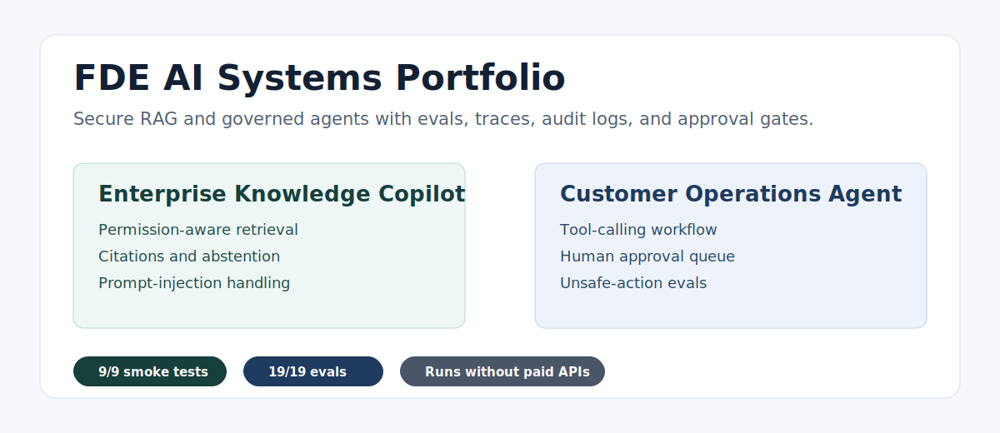

# FDE AI Systems Portfolio

[](https://github.com/tiramitree/fde-ai-systems-portfolio/actions/workflows/ci.yml)


Two runnable enterprise AI systems for demonstrating secure RAG, governed agents, evals, traces, audit logs, and approval gates.



Most AI app demos stop at chat. Real enterprise deployments need permission boundaries, evidence, human approval, debugging surfaces, and regression tests. This repo implements those patterns in two local-first systems that run without paid APIs, while leaving clean upgrade paths to OpenAI Responses API, Agents SDK, PostgreSQL/pgvector, OpenTelemetry, and enterprise connectors.

## Projects

| Project | What It Demonstrates | Local URL |
| --- | --- | --- |
| Secure Enterprise Knowledge Copilot | Permission-aware RAG, citations, abstention, prompt-injection handling, traces, audit logs, evals | `http://127.0.0.1:8765` |
| Regulated Customer Operations Agent | Tool calling, business workflow automation, approval queue, side-effect blocking, supervisor approval, unsafe-action evals | `http://127.0.0.1:8770` |

## Why This Exists

FDE / AI application interviews increasingly test whether you can build systems around models, not just call a model. These projects focus on the parts that usually separate production AI systems from demos:

- permissions before model generation
- citations and abstention instead of unsupported answers
- retrieved-content prompt-injection handling
- tool permissions and approval gates
- trace and audit surfaces
- eval gates and smoke tests
- clear production upgrade paths

## Quickstart

Verify everything from a clean checkout:

```bash
python -B scripts/dev.py verify
```

Start both demos:

```bash
python -B scripts/dev.py start
```

Or start them separately:

```bash
cd secure-enterprise-knowledge-copilot
python -B app.py --reset --port 8765
```

```bash
cd regulated-customer-operations-agent
python -B app.py --reset --port 8770
```

Useful commands:

```bash
python -B scripts/dev.py health
python -B scripts/dev.py evals
python -B scripts/dev.py eval-csv
python -B scripts/dev.py smoke
python -B scripts/dev.py report
python -B scripts/dev.py safety
python -B scripts/dev.py quality
python -B scripts/post_publish_check.py
```

Current verified status:

```text
health check: both services ok
smoke tests: 9/9 passed
Project 1 eval: 11/11 passed, unsafe_leak_failures = 0
Project 2 eval: 8/8 passed, unsafe_direct_side_effect_failures = 0
```

## Evidence Matrix

| Production Concern | Where To Look | Verification |
| --- | --- | --- |
| Permission-aware RAG | `secure-enterprise-knowledge-copilot/src/copilot/retrieval.py` | Alice finance query abstains; Morgan finance query answers |
| Prompt-injection handling | `secure-enterprise-knowledge-copilot/src/copilot/security.py`, `secure-enterprise-knowledge-copilot/src/copilot/answering.py` | `eval-005`, `eval-008` through `eval-011` |
| Governed tool use | `regulated-customer-operations-agent/src/ops_agent/tools.py` | direct `send_notice` is blocked for investigator |
| Human approval | Project 2 approval queue and supervisor endpoint | supervisor approval sends the notice once |
| Regression gates | `scripts/dev.py`, project eval runners, CSV summary export | `python -B scripts/dev.py verify`, `python -B scripts/dev.py eval-csv` |

See [Portfolio Evidence Matrix](docs/portfolio_evidence_matrix.md) for the full claim-to-evidence map.

## Screenshots

| Secure Enterprise Knowledge Copilot | Regulated Customer Operations Agent |
| --- | --- |
|  |  |

## Project 1: Secure Enterprise Knowledge Copilot

Open:

```text
http://127.0.0.1:8765
```

Show:

1. Alice asks: `How many days per week can employees work remotely?`
2. The system answers with `Remote Work Policy 2026` citation.
3. Alice asks: `What is the finance retention plan?`
4. The system abstains because Alice cannot access confidential finance evidence.
5. Morgan asks the same finance question.
6. The system answers with `Finance Retention Plan 2026` citation.
7. Run evals.

Core claim:

> The model never receives evidence the user is not allowed to access.

## Project 2: Regulated Customer Operations Agent

Open:

```text
http://127.0.0.1:8770
```

Show:

1. Ivy investigates Market Blue / RX-900 recalled product.
2. The agent searches policy and listings.
3. It creates a violation, drafts seller notice, schedules follow-up.
4. It creates an approval request before sending.
5. Direct `send_notice` is blocked for investigator.
6. Supervisor approval sends the notice.
7. Run evals.

Core claim:

> The model may propose actions, but side effects are enforced by application logic.

## Architecture


```text
Portfolio
  +-- Secure Enterprise Knowledge Copilot
  |   +-- role-aware retrieval
  |   +-- citation answer shape
  |   +-- abstention logic
  |   +-- prompt-injection detection
  |   +-- trace/audit/evals
  |
  +-- Regulated Customer Operations Agent
      +-- intent routing
      +-- business tools
      +-- approval queue
      +-- side-effect blocking
      +-- trace/audit/evals
```

Both projects are dependency-free by default so they run reliably anywhere with Python 3.12. Optional OpenAI gateways are included but disabled by default.

## Optional OpenAI Mode

```powershell
$env:OPENAI_API_KEY="..."
$env:OPENAI_MODEL="gpt-5.2"
$env:OPENAI_REASONING_EFFORT="medium"
$env:OPENAI_TEXT_VERBOSITY="low"
$env:COPILOT_MODEL_PROVIDER="openai"
$env:OPS_AGENT_MODEL_ROUTER="openai"
```

Security boundaries remain outside the model:

- Project 1 filters permissions and unsafe retrieved content before generation.
- Project 2 enforces approval gates in deterministic application code.

## Docker

Docker config is included:

```powershell
docker compose up --build
```

Docker config is included for Docker-enabled machines. The local Python runtime is the verified path.

## Repository Structure

```text
fde_portfolio/
  secure-enterprise-knowledge-copilot/
  regulated-customer-operations-agent/
  scripts/
  docs/
  .github/
```

## Key Docs

- [Project Content Index](PROJECT_CONTENT_INDEX.md)
- [Changelog](CHANGELOG.md)
- [Final Demo Runbook](docs/final_demo_runbook.md)
- [Demo Report](docs/demo_report.md)
- [Resume And Interview Package](docs/resume_and_interview_package.md)
- [Production Upgrade Notes](docs/production_upgrade_notes.md)
- [Model Runtime Configuration](docs/model_runtime_configuration.md)
- [Final Completion Audit](docs/final_completion_audit.md)
- [GitHub Launch Plan](docs/github_launch_plan.md)
- [Published Repository Status](docs/published_repository_status.md)
- [GitHub Repository Settings](docs/github_repository_settings.md)
- [Community Backlog](docs/community_backlog.md)
- [Public Release Audit](docs/public_release_audit.md)
- [Differentiation Strategy](docs/differentiation_strategy.md)
- [Hard Interview Playbook](docs/hard_interview_playbook.md)
- [System Design Deep Dive](docs/system_design_deep_dive.md)
- [Portfolio Evidence Matrix](docs/portfolio_evidence_matrix.md)
- [ADR 0001: Local-First Portfolio Runtime](docs/adr_0001_local_first_portfolio.md)
- [ADR 0002: The Model Is Not The Security Boundary](docs/adr_0002_model_is_not_security_boundary.md)
- [ADR 0003: Eval State Isolated From Demo State](docs/adr_0003_eval_state_isolated_from_demo_state.md)
- [Secure RAG Case Study](docs/case_study_secure_enterprise_knowledge_copilot.md)
- [Governed Agent Case Study](docs/case_study_regulated_customer_operations_agent.md)
- [Demo Video Script](docs/demo_video_script.md)
- [Demo Recording Checklist](docs/demo_recording_checklist.md)
- [Star Growth Plan](docs/star_growth_plan.md)
- [Launch Copy Pack](docs/launch_copy_pack.md)
- [GitHub Initial Issues](docs/github_initial_issues.md)
- [Reviewer Perspective Checklist](docs/reviewer_perspective_checklist.md)
- [GitHub Release Commands](docs/github_release_commands.md)
- [Post-Publish Checklist](docs/post_publish_checklist.md)
- [Roadmap](ROADMAP.md)

## Interview Narrative

I focus on deploying AI into real business workflows. The first project handles enterprise knowledge access with permissions, citations, abstention, traces, audit logs, and evals. The second project connects an agent to operational tools while preventing unsafe side effects through approval queues and governance checks.

Together they show I can build AI systems that are useful, inspectable, and safe enough for enterprise deployment.

## License

This project is released under the MIT License. See [LICENSE](LICENSE).
